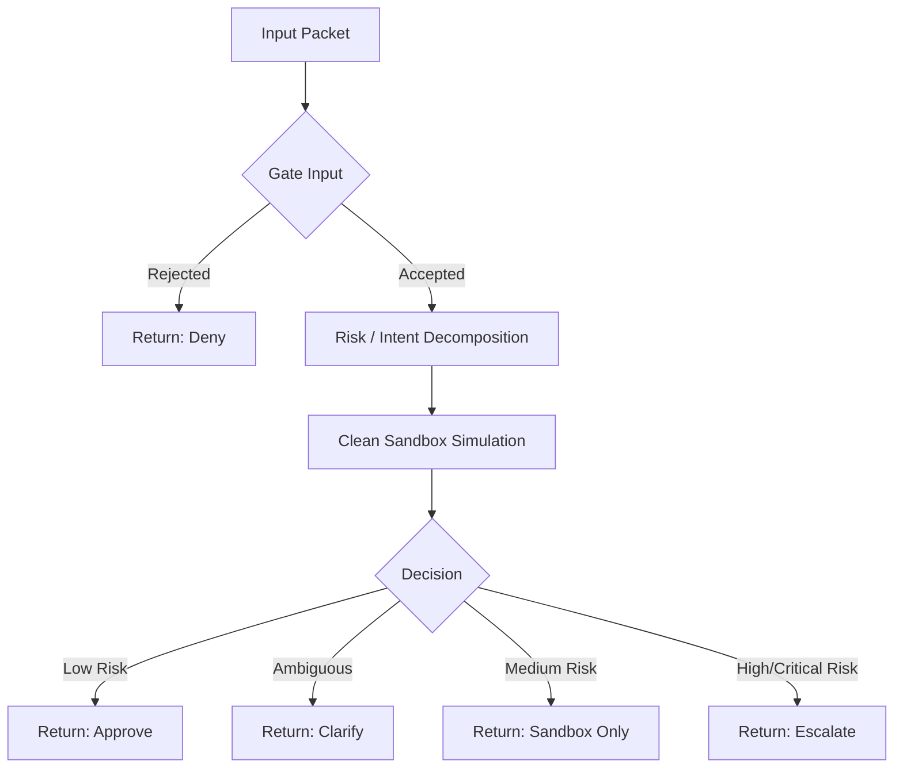
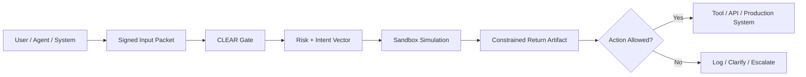
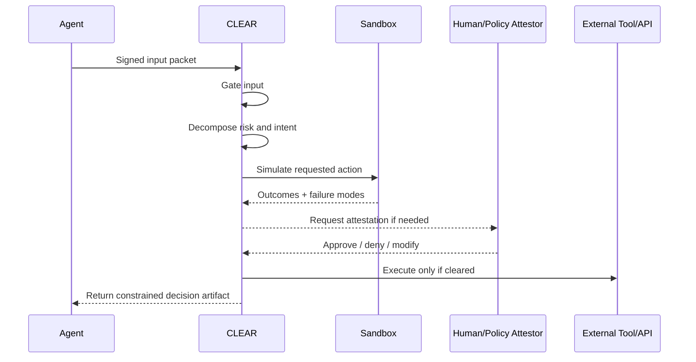

# Mermaid Diagrams

## Runtime Loop

```mermaid
flowchart TD
    A[Input Packet] --> B{Gate Input}
    B -- Rejected --> X[Return: Deny]
    B -- Accepted --> C[Risk / Intent Decomposition]
    C --> D[Clean Sandbox Simulation]
    D --> E{Decision}
    E -- Low Risk --> F[Return: Approve]
    E -- Ambiguous --> G[Return: Clarify]
    E -- Medium Risk --> H[Return: Sandbox Only]
    E -- High/Critical Risk --> I[Return: Escalate]
```

## CLEAR as an Agentic Membrane

```mermaid
flowchart LR
    U[User / Agent / System] --> P[Signed Input Packet]
    P --> G[CLEAR Gate]
    G --> R[Risk + Intent Vector]
    R --> S[Sandbox Simulation]
    S --> C[Constrained Return Artifact]
    C --> A{Action Allowed?}
    A -- Yes --> T[Tool / API / Production System]
    A -- No --> L[Log / Clarify / Escalate]
```

## Attestation Future State

```mermaid
sequenceDiagram
    participant Agent
    participant CLEAR
    participant Sandbox
    participant Human as Human/Policy Attestor
    participant Tool as External Tool/API

    Agent->>CLEAR: Signed input packet
    CLEAR->>CLEAR: Gate input
    CLEAR->>CLEAR: Decompose risk and intent
    CLEAR->>Sandbox: Simulate requested action
    Sandbox-->>CLEAR: Outcomes + failure modes
    CLEAR-->>Human: Request attestation if needed
    Human-->>CLEAR: Approve / deny / modify
    CLEAR->>Tool: Execute only if cleared
    CLEAR-->>Agent: Return constrained decision artifact
```
