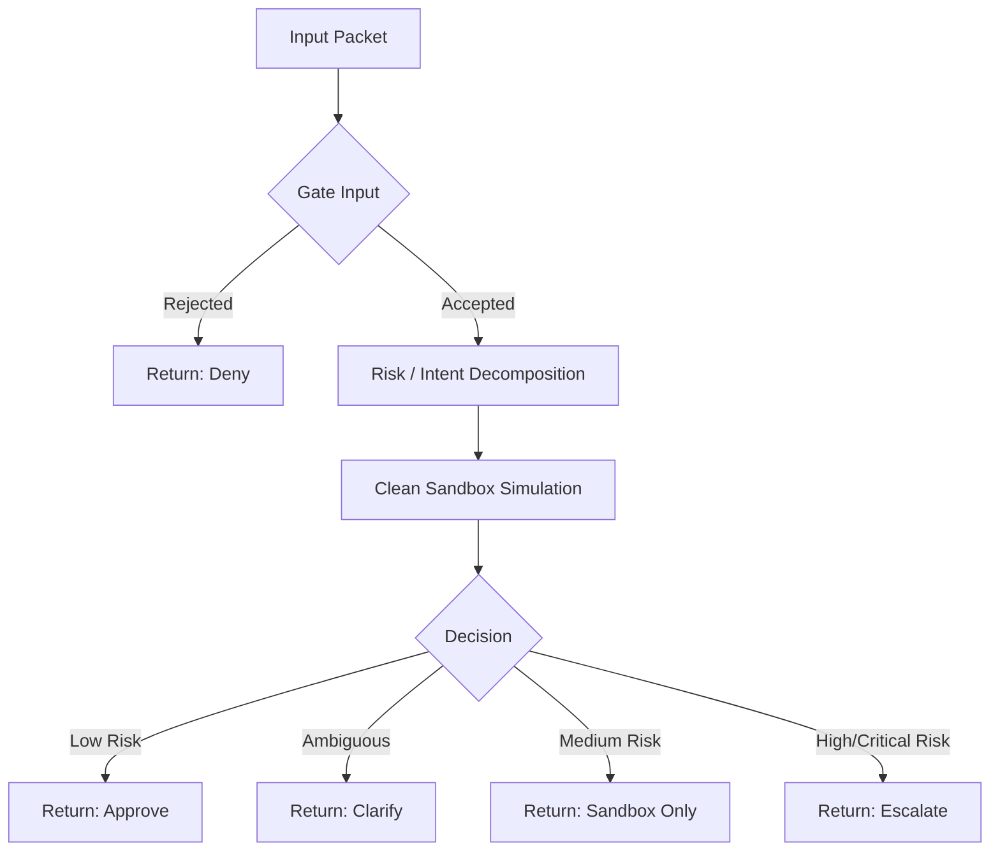
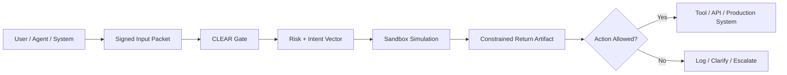
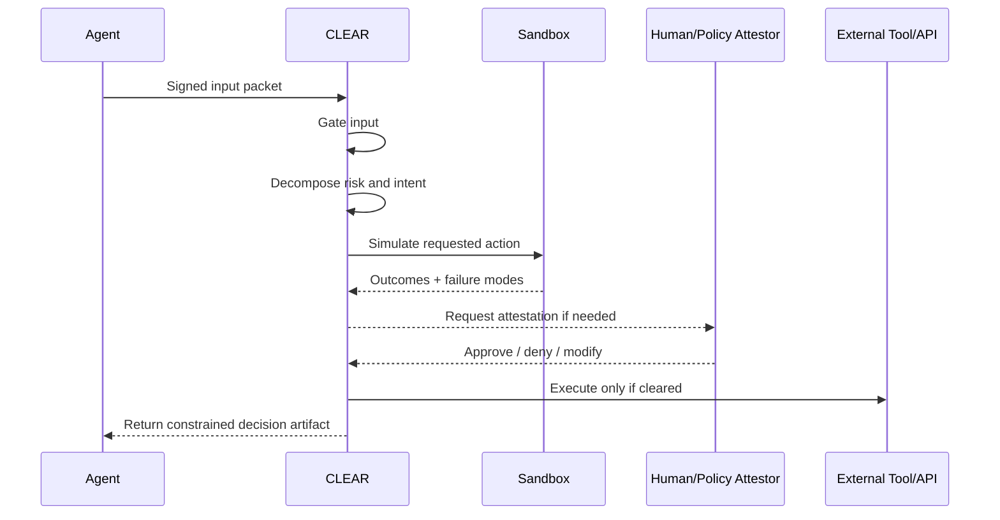

# CLEAR Runtime Loop v0

**Gate → Decompose → Sandbox → Return**

A minimal, forkable Python demo for a CLEAR-style runtime loop for agentic systems.

This repo demonstrates a simple principle:

> **No input becomes action until it survives gating, risk/intent decomposition, and clean sandbox simulation.**

## Why this exists

Modern AI agents can receive instructions, infer actions, call tools, and affect external systems. The core risk is not just model error. The risk is allowing untrusted or ambiguous input to become real-world action without an explicit decision membrane.

CLEAR Runtime v0 introduces a small, legible membrane:

1. **Gate input**  
   Reject obvious evasion, secrecy, missing identity, or malformed requests.

2. **Extract risk / intent vector**  
   Decompose the request into intent, authority requested, risk vectors, ambiguity flags, and affected entities.

3. **Clean sandbox simulation**  
   Simulate consequences without touching real systems, APIs, money, production databases, physical actuators, or external communications.

4. **Return constrained decision artifact**  
   Return `approve`, `deny`, `clarify`, `escalate`, or `sandbox_only`, with reasons and required attestations.

## File

- `clear_runtime_loop.py` — standard-library-only Python demo.

## Run

```bash
python3 clear_runtime_loop.py
```

No dependencies required.

## Core thesis

Most agentic systems implicitly assume:

> input → reasoning → action

CLEAR inserts a membrane:

> input → gate → decompose → sandbox → return → action only if cleared

## Mermaid: Runtime Loop



## Mermaid: CLEAR as an Agentic Membrane



## Mermaid: Attestation Future State



## Example decisions

- `approve` — low-risk, reversible action.
- `deny` — input fails the gate.
- `clarify` — ambiguity is too high.
- `sandbox_only` — simulation allowed, execution not yet cleared.
- `escalate` — human/policy attestation required.

## Relationship to the broader stack

This is a minimal seed for:

- **agentic mTLS** — identity and signed input packets
- **CLEAR** — action gating and legibility membrane
- **BRIDGE** — translation between organizational ontologies and policy schemas
- **ATLAS** — contestation and review of high-impact decisions
- **ZetaPoint** — decentralized attestation substrate
- **AGPI** — broader physics-native and reliability-oriented intelligence infrastructure

## What this is not

This is not a production security system.

This is not legal, compliance, or safety advice.

This is not a replacement for human judgment, policy review, formal verification, security engineering, or domain-specific risk management.

It is a simple reference pattern for building more reliable agentic systems.

## Suggested repo description

> Minimal CLEAR runtime loop for agentic systems: gate input, decompose risk/intent, simulate in a clean sandbox, return constrained decision artifacts.

## License suggestion

For broad adoption, use Apache-2.0 or MIT.

For attribution-sensitive release, keep this repo open but reserve proprietary orchestration, scoring, enterprise adapters, and production deployment logic.
